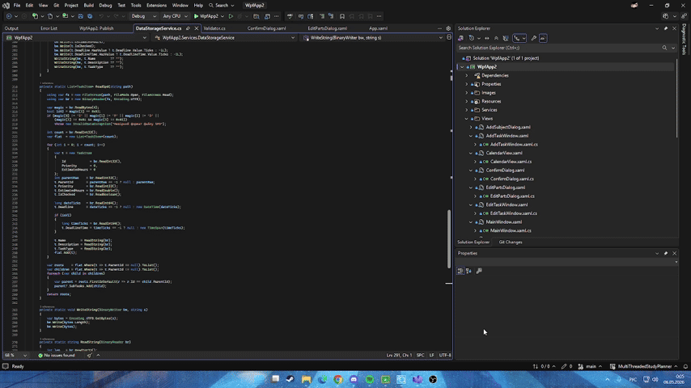

<div align="center">


# Student Planner

**Програма-органайзер для студента**

[](https://dotnet.microsoft.com/)
[](https://learn.microsoft.com/en-us/dotnet/desktop/wpf/)
[](https://www.sqlite.org/)

Настільний застосунок для планування навчального навантаження, відстеження задач і аналізу продуктивності студента.

</div>
<div align="center">
  
</div>

## ✨ Можливості

| Модуль | Функціонал |
|---|---|
| 📋 **Задачі** | Створення, редагування, видалення задач із дедлайнами, типами та пріоритетами |
| 🔀 **Розбиття** | Автоматичний поділ задачі на частини з рівномірним розподілом годин |
| 📅 **Календар** | Перегляд задач по датах, додавання задачі прямо з клітинки дня |
| 📊 **Статистика** | KPI-картки, графіки навантаження, топ задач, акордеон по предметах |
| 🎓 **Предмети** | Прив'язка задач до навчальних предметів із кольоровим маркуванням |
| 🍅 **Помодоро** | Вбудований таймер фокусу з фазами роботи та перерв |
| 📝 **Нотатки** | Кольорові нотатки в боковій панелі |
| 🔔 **Сповіщення** | Системний трей із попередженнями про дедлайни та перевантаження |
| 🗂️ **Логування** | Багаторівневий журнал подій із ротацією файлів |

---

## 🏗️ Архітектура

```
WpfApp2/
│
├── 📄 TaskItem.cs                         # Модель задачі (INotifyPropertyChanged)
├── 📄 AssemblyInfo.cs
├── 📄 InverseBoolToVisibilityConverter.cs
├── 📄 StringToBrushConverter.cs
├── 📄 GlobalUsings.cs                     # Глобальні псевдоніми просторів імен
├── 📁Images
├── 📁 Services/
│   ├── TaskManager.cs                     # Центральний координатор задач
│   ├── Validator.cs                       # Валідація вхідних даних
│   ├── BackgroundProcessor.cs             # Фоновий потік перевірки дедлайнів
│   ├── DatabaseService.cs                 # SQLite CRUD
│   ├── PlannerService.cs                  # Алгоритм пріоритетів + планування
│   ├── ProductivityReport.cs              # Метрики продуктивності
│   ├── TaskTypeService.cs                 # Ваги типів задач, шаблони підзадач
│   ├── NotesService.cs                    # Управління нотатками
│   ├── PomodoroService.cs                 # Таймер Помодоро (скінченний автомат)
│   ├── TrayService.cs                     # Системний трей
│   ├── AppLogger.cs                       # Багаторівневе логування
│   └── SubjectService.cs                  # Управління предметами
│   └── DataStorageService.cs              # Ведення журналу змін та власний
│
└── 📁 Views/
    ├── MainWindow.xaml / .cs              # Головне вікно, навігація
    ├── AddTaskWindow.xaml / .cs           # Діалог додавання задачі
    ├── EditTaskWindow.xaml / .cs          # Діалог редагування задачі
    ├── StatisticsView.xaml / .cs          # Графіки LiveChartsCore + KPI
    ├── TasksView.xaml / .cs               # DataGrid задач із підзадачами
    ├── OverloadDialog.xaml / .cs          # Попередження про перевантаження
    ├── SplitTaskDialog.xaml / .cs         # Розбиття задачі на частини
    ├── BreakReminderWindow.xaml / .cs     # Нагадування про перерву
    ├── CalendarView.xaml / .cs            # Динамічний календар 7×6
    ├── EditPartsDialog.xaml / .cs         # Редагування частин задачі
    ├── MiniCalendarPanel.xaml / .cs       # Міні-календар у боковій панелі
    ├── NotesPanel.xaml / .cs              # Панель нотаток
    ├── PomodoroWidget.xaml / .cs          # Віджет таймера Помодоро
    ├── SplitPartDialog.xaml / .cs         # Розбиття окремої частини
    ├── AddSubjectDialog.xaml / .cs        # Діалог додавання предмету
    ├── SubjectsView.xaml / .cs            # Акордеон предметів
    └── ConfirmDialog.xaml / .cs           # Універсальне вікно підтвердження

```
## ⚙️ Алгоритм розрахунку пріоритетів

Пріоритет кожної задачі обчислюється автоматично за формулою:

$$priority = urgency \times 0.5 + importance \times 5.0 + completion \times 15.0$$

де:
- **urgency** — терміновість: `100 / (1 + hoursLeft / 24)`, для прострочених — `100 + |hoursLeft| × 2`
- **importance** — вага типу задачі (від 2 для лекцій до 10 для іспитів)
- **completion** — частка незавершеної роботи `(100 - progress) / 100`

---

## 🛠️ Технології

| Технологія | Версія | Призначення |
|---|---|---|
| .NET | 10.0 | Платформа виконання |
| WPF | — | Графічний інтерфейс |
| SQLite (`Microsoft.Data.Sqlite`) | — | Основна база даних |
| LiveChartsCore + SkiaSharp | — | Графіки та діаграми |
| Windows Forms (`NotifyIcon`) | — | Системний трей |

---

## 🚀 Запуск

### Вимоги

- Windows 10 / 11
- [.NET 10.0 Runtime](https://dotnet.microsoft.com/download/dotnet/9.0)

### Збірка з вихідного коду

```bash
git clone https://github.com/YOUR_USERNAME/student-planner.git
cd student-planner
dotnet build
dotnet run --project WpfApp2
```


---

## 🗄️ База даних

Застосунок автоматично створює файл `tasks.db` (SQLite) при першому запуску.

```sql
-- Основні таблиці
Tasks     (Id, Name, Description, IsChecked, Deadline, DeadlineTime,
           TaskType, Priority, EstimatedHours, ParentId, SubjectId)
Subjects  (Id, Name, Color)
Notes     (Id, Content, Color)
```

Підзадачі зберігаються у тій самій таблиці `Tasks` через поле `ParentId` (патерн «суміжний список»).

---

## 📁 Файли даних

| Файл | Призначення |
|---|---|
| `tasks.db` | SQLite база даних |
| `data/tasks.spd` | Резервне бінарне сховище (власний формат) |
| `data/changelog.log` | Журнал змін задач |
| `logs/app_YYYYMMDD.log` | Журнал роботи застосунку |

---

## 👤 Автор

**Карпачова Валерія** — КНУ — КІ-23  
Курсовий проєкт з системного програмування

---

<div align="center">

Зроблено з ☕

</div>

